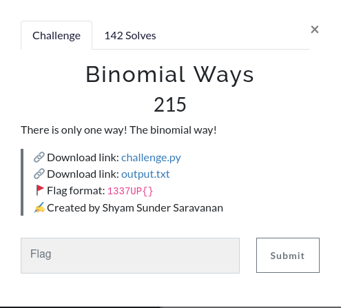

We are given the following code:
```python
from secret import flag
val = []
flag_length = len(flag)
print(flag_length)

def factorial(n):
    f = 1
    for i in range(2, n+1):
        f *= i
    return f

def series(A, X, n):
    nFact = factorial(n)
    for i in range(0, n + 1):
        niFact = factorial(n - i)
        iFact = factorial(i)
        aPow = pow(A, n - i)
        xPow = pow(X, i)
        val.append(int((nFact * aPow * xPow) / (niFact * iFact)))

A = 1; X = 1; n = 30
series(A, X, n)
ct = []
for i in range(len(flag)):
    ct.append(chr(ord(flag[i])+val[i]%26))
print(''.join(ct))
```
Analyzing the code we find that the same numbers are always generated, so we can easily get the original message by changing this line.
```python
ct.append(chr(ord(flag[i])+val[i]%26))
```
to this.

```python
ct.append(chr(ord(flag[i])-val[i]%26))
```
(Full code in case you need it)
```python
flag = "27F;VPbAs>clu}={9ln=_o1{0n5tp~"
val = []
flag_length = len(flag)
print(flag_length)

def factorial(n):
    f = 1
    for i in range(2, n+1):
        f *= i
    return f

def series(A, X, n):
    nFact = factorial(n)
    for i in range(0, n + 1):
        niFact = factorial(n - i)
        iFact = factorial(i)
        aPow = pow(A, n - i)
        xPow = pow(X, i)
        val.append(int((nFact * aPow * xPow) / (niFact * iFact)))

A = 1; X = 1; n = 30
series(A, X, n)
pt = []
for i in range(len(flag)):
     pt.append(chr((ord(flag[i])-val[i]%26)&255))
print("".join(pt))
```
```shell
❯ python solve.py
30
1337UPUAf>Vlh{(o$ja=Ro${#n4p]z
```
(Apparently this flag was bugged, hence the format). 
