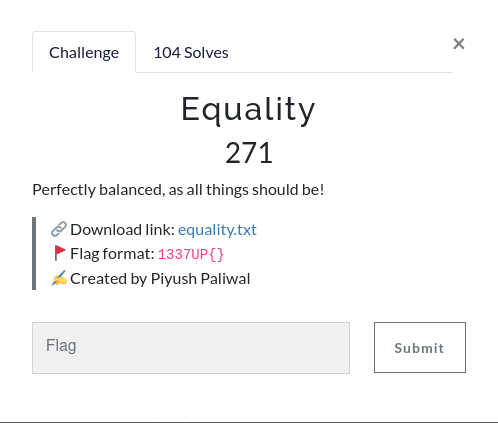

We have a txt file with the following RSA values:
```ptyhon
n = '0xa6241c28743fbbe4f2f67cee7121497f622fd81947af30f327fb028445b39c2d517ba7fdcb5f6ac9e6217205f8ec9576bdec7a0faef221c29291c784eed393cd95eb0d358d2a1a35dbff05d6fa0cc597f672dcfbeecbb14bd1462cb6ba4f465f30f22e595c36e6282c3e426831d30f0479ee18b870ab658a54571774d25d6875' 
e = '0x3045' 
ct = '0x5d1e39bc751108ec0a1397d79e63c013d238915d13380ae649e84d7d85ebcffbbc35ebb18d2218ccbc5409290dfa8a4847e5923c3420e83b1a9d7aa67190dc0d34711cce261665c64c28ed2834394d4b181926febf7eb685f9ce81f36c7fb72798da3a14a123287171d26e084948aab0fba81c53f10b5696fc291006254ee690'

n2 = '0xa6241c28743fbbe4f2f67cee7121497f622fd81947af30f327fb028445b39c2d517ba7fdcb5f6ac9e6217205f8ec9576bdec7a0faef221c29291c784eed393cd95eb0d358d2a1a35dbff05d6fa0cc597f672dcfbeecbb14bd1462cb6ba4f465f30f22e595c36e6282c3e426831d30f0479ee18b870ab658a54571774d25d6875' 
e2 = '0xff4d' 
ct2 = '0x3d90f2bec4fe02d8ce4cece3ddb6baed99337f7e6856eef255445741b5cfe378390f058679d70236e51be4746db4c207f274c40b092e24f8c155a0957867e84dca48e27980af488d2615a280c6eadec2f1d30b95653b1ee3135e2edff100dd2c529994f846722f811348b082d0bec7cfab579a4bd0ab789928b1bebed68d628f'
```
Both n's are the same, but the cipher texts and e's are different. 

Thanks to [this page](https://bitsdeep.com/posts/attacking-rsa-for-fun-and-ctf-points-part-1/) and [this page](https://codeforgeweb.wordpress.com/2018/11/20/square-ctf-2018-c2-flipping-bits/) i could come up with a solution, this attack is known as <strong>common modulus attack.</strong>

We can recover the flag following the [Bézout’s identity](https://en.wikipedia.org/wiki/B%C3%A9zout%27s_identity) which states:
```
There exist integers or polynomials x and y such that ax + by = d
```
Where **a** and **b** are **our e's**, and **d** is the **gcd** of both e's (in the case of my implementation x is u and y is v). We can get these numbers using the extended euclidean algorithm, so i used [this implementation](https://www.techiedelight.com/extended-euclidean-algorithm-implementation/).
```python
def extended_gcd(a, b):
    if a == 0:
        return b, 0, 1
    else:
        gcd, x, y = extended_gcd(b % a, a)
        return gcd, y - (b // a) * x, x
```

We get that **u = 9240** and **v = -1747**, since v is negative we need to compute the inverse of the second ciphertext.
```python
ct2_inv = (inverse(ct2, n))
```
And to get the message we need to perform the following operation:
```python
m = (pow(ct, u, n) * pow(ct2_inv, -v, n)) % n
```
Full python code 
```python
from Crypto.Util.number import getPrime, inverse, bytes_to_long, long_to_bytes, GCD
from ast import literal_eval

def extended_gcd(a, b):
    if a == 0:
        return b, 0, 1
    else:
        gcd, x, y = extended_gcd(b % a, a)
        return gcd, y - (b // a) * x, x

n = '0xa6241c28743fbbe4f2f67cee7121497f622fd81947af30f327fb028445b39c2d517ba7fdcb5f6ac9e6217205f8ec9576bdec7a0faef221c29291c784eed393cd95eb0d358d2a1a35dbff05d6fa0cc597f672dcfbeecbb14bd1462cb6ba4f465f30f22e595c36e6282c3e426831d30f0479ee18b870ab658a54571774d25d6875' 
e = '0x3045' 
ct = '0x5d1e39bc751108ec0a1397d79e63c013d238915d13380ae649e84d7d85ebcffbbc35ebb18d2218ccbc5409290dfa8a4847e5923c3420e83b1a9d7aa67190dc0d34711cce261665c64c28ed2834394d4b181926febf7eb685f9ce81f36c7fb72798da3a14a123287171d26e084948aab0fba81c53f10b5696fc291006254ee690'

n2 = '0xa6241c28743fbbe4f2f67cee7121497f622fd81947af30f327fb028445b39c2d517ba7fdcb5f6ac9e6217205f8ec9576bdec7a0faef221c29291c784eed393cd95eb0d358d2a1a35dbff05d6fa0cc597f672dcfbeecbb14bd1462cb6ba4f465f30f22e595c36e6282c3e426831d30f0479ee18b870ab658a54571774d25d6875' 
e2 = '0xff4d' 
ct2 = '0x3d90f2bec4fe02d8ce4cece3ddb6baed99337f7e6856eef255445741b5cfe378390f058679d70236e51be4746db4c207f274c40b092e24f8c155a0957867e84dca48e27980af488d2615a280c6eadec2f1d30b95653b1ee3135e2edff100dd2c529994f846722f811348b082d0bec7cfab579a4bd0ab789928b1bebed68d628f'

n = (literal_eval(n))
e = (literal_eval(e))
e2 = (literal_eval(e2))
ct = (literal_eval(ct))
ct2 = literal_eval(ct2)
gdc, u,v = extended_gcd(e,e2)
ct2_inv = (inverse(ct2, n))
m = (pow(ct, u, n) * pow(ct2_inv, -v, n)) % n
print(long_to_bytes(m))
```
```shell
❯ python solve.py
b'1337UP{c0mm0n_m0dulu5_4774ck_15_n07_50_c0mm0n}'
```
