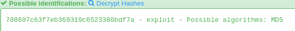

<h1>Passwd</h1>

<h3>Find out the password of knight user.</h3>

<h4>We are given a file with a linux log in the last line we have a hash</h4>

<h4>if we enter this hash in hashkiller we get the following</h4>

<h4> flag is KCTF{exploit} </h4> 

