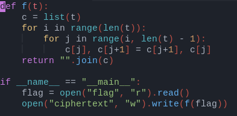

<h1>Jumble<h1>

<h3>My friend Saif from Saudi Arabia has started his CS course. Being a fan of cryptography, he tries to apply everything taught in his courses to enccrypt stuffs. Recently, he sent me this script and a ciphertext. Can you find out what he wants to say?</h3>

<h4> We have the following code<h4>

<h4> and the following ciphertext </h4>

<strong>0un5hfz02zq=ntvb0=rzfmsx</strong>

<h4> we do the inverse process and get the flag </h4>

<h4> flag is: KCTF{y0u_g0t_m3} </h4> 
