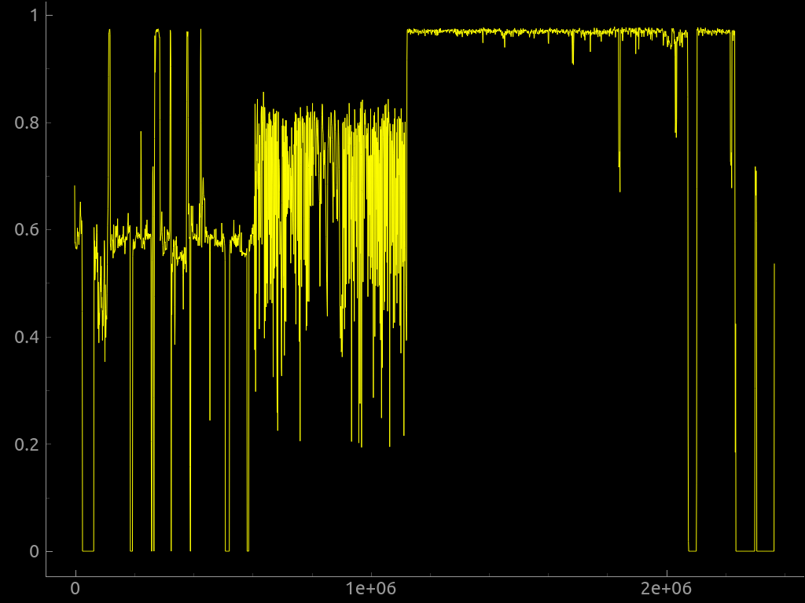

<h1> Let's Walk Together <h1>

<h3> Do you know anything about this image? </h3>

I used foremost in the image which revealed a folder named zip that contains a zip inside. I performed the following operations in it and found the password. 

Once i had the password i unzipped it and open the flag.txt file

<strong> The flag is: KCTF{BiNw4lk_is_h3lpfUl} </strong>

