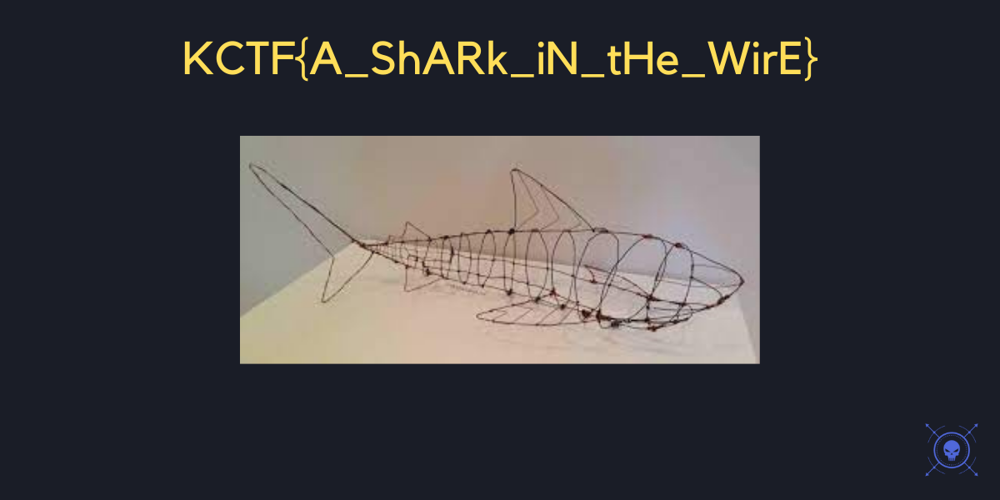

<h1> How's the Shark? </h1>

<h3> Find the flag from the following. </h3>

 We are given a pcapng file i tried to find the flag with strings but the result was a fake flag 

So i decided to export the http objects, inside of these objects we have a picture with the flag.

