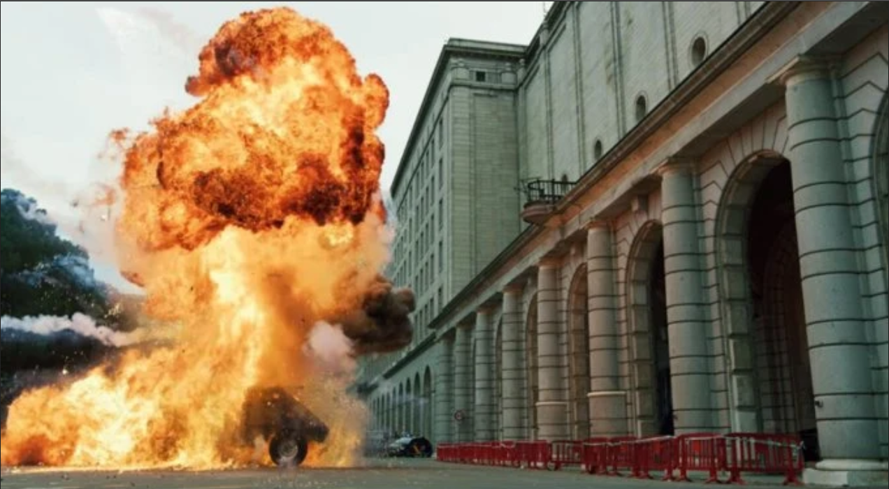

<h1>Explosion In Front Of Bank Of Spain</h1>

<h3>One of my friend sent me the picture and told me that, there was an explotion in front of the Bank of Spain by some robbers a few days ago. After hearing that, I googled about incident. But I discovered that, The picture he gave is not the picture of Bank Of Spain. So, now I want to know the exact location of the picture so that I can know about the incident of that explotion. Can you please help me to find that place? Please send me the coordinates of that location if you can figure it out. 
Flag Format: KCTF{xx.xxxxxxx,-x.xxxxxxx}.
</h3>

I reversed search the image in yandex and found [this article](https://www.klook.com/en-SG/blog/money-heist-film-locations/). 

If you check the fifth position in the top you'll find that it is Ministerio de Transportes, Movilidad y Agenda Urbana in Spain. 

Search it in google maps, the coordinates are in the url.

<strong>The flag is: KCTF{40.4442164,-3.6936083}</strong>

