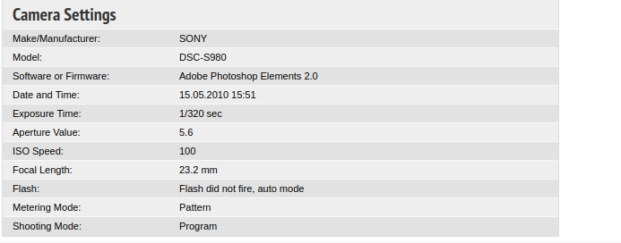

<h1>Find The Camera</h1>

<h3>Can you find the manufacturer and the model number of the camera that took the picture of this bus? 

Note: The whole flag is in Upper Case letters and replace any special character or space with underscores. 

Flag Format: KCTF{MANUFACTURER_MODEL_SINGLELETTERNUMBER}</h3>

 I reversed search the image in yandex and found one russian page that contained it
(http://fotobus.msk.ru/photo/267442/?vid=204172), scrolling down i found all the data of the bus and camera.

<strong>The flag is: KCTF{SONY_DSC_S980}</strong>
