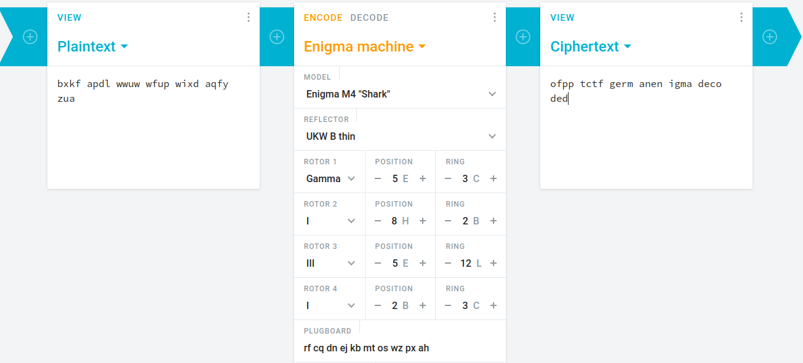

# German riddle
#####  We have intercepted a suspicious communication, but unfortunately, some data was corrupted during transmission. Can you recover the message?
##### M4 UKW $ Gamma 5 3 $ 8 2 $ 5 12 $ 2 ? rf cq dn ej kb mt os wz px ah
##### Ciphertext: bxkf apdl wwuw wfup wixd aqfy zua (Words in the flag should be separated by underscores, and the flag formatted as : OFPPT-CTF{text_after_ofpptctf})

The title and description imply this is an [enigma cipher](https://en.wikipedia.org/wiki/Enigma_machine), so i went to [cryptii](https://cryptii.com/) and entered the parameters of the description.

**OFPPT-CTF{german_enigma_decoded}**
