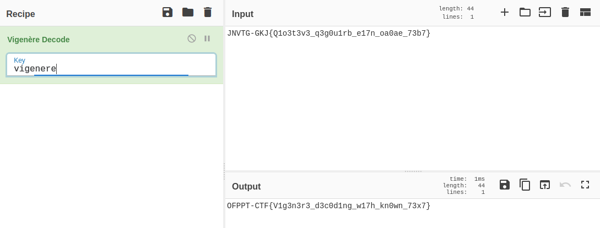

# Lost Key
#####  Can you decipher the following? JNVTG-GKJ{Q1o3t3v3_q3g0u1rb_e17n_oa0ae_73b7}
##### By the way, I lost the key. Sorry!

We have a keyed cipher, which i thought was vigenere, so i tried bruteforcing the key since the first part of the text is known (OFPPT-CTF). For this task i used [cyberchef](https://gchq.github.io/CyberChef/).

Turns out the key for the ciphertext was **vigenere.**

