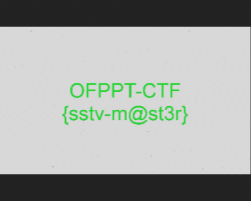

# Weird sounds 
##### This weird sound is coming from my grandma's old TV, and I think it is a secret message. Can you help me decode this?

We are given and audio that sounds like sstv, so i tried decoding using this [tool](https://github.com/colaclanth/sstv).
```shell
❯ sstv -d weird.wav -o flag.png
[sstv] Searching for calibration header... Found!
[sstv] Detected SSTV mode Martin 1
[sstv] Decoding image...                 [####################################################################################################] 100%
[sstv] Drawing image data...
[sstv] ...Done!
```
We get the following image.



