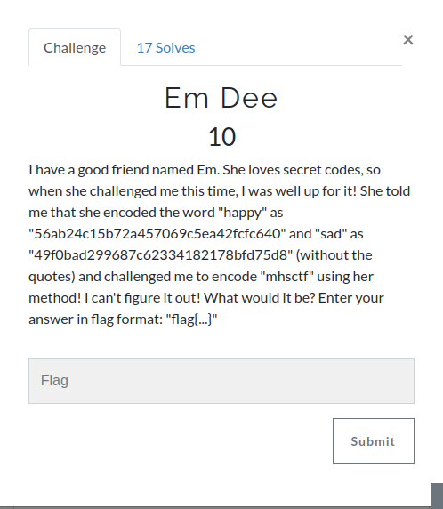
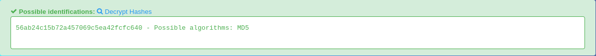

This challenge is fairly easy, we need to encode the word <strong> mhsctf</strong>.

The first thing we need to do is to know which kind of hash is that of the examples. If we enter the one of the hashes in hashkiller we find out that is **md5**



The next step is to encode the plaintext

```python
>>> import hashlib
>>> hashlib.md5(b'mhsctf').hexdigest()
'fc3e3c405a66f8fe7cb7f17a838ea88c'
```
**the flag is: flag{fc3e3c405a66f8fe7cb7f17a838ea88c}**
