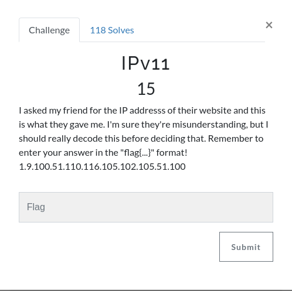

I got the letters for the ascii values.

```python
>>> numbers = [1, 9, 100, 51, 110, 116, 105, 102, 105, 51, 100]
>>> "".join(chr(x) for x in numbers)
'\x01\td3ntifi3d'
```
The 1 and 9 are symbols that aren't useful (the 1 being a start of header and 9 tab), but as we can see we are left with d3ntifi3d and the 1 before the tab completes the word.

**The flag is: flag{1d3ntifi3d}**

