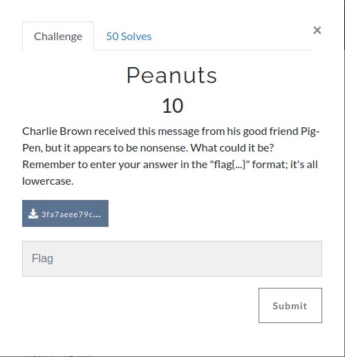

This is the cipher.


We have a hint of the cipher in the description of the challenge (**pig-pen**), i searched for a decoder online and [found one](https://planetcalc.com/7842/), i introduced the flag and got the following result.


I just needed to convert it to lowercase.

```python
>>> "GOODGRIEFCHARLIEBROWN".lower()
'goodgriefcharliebrown'
```

**The flag is: flag{goodgriefcharliebrown}**
