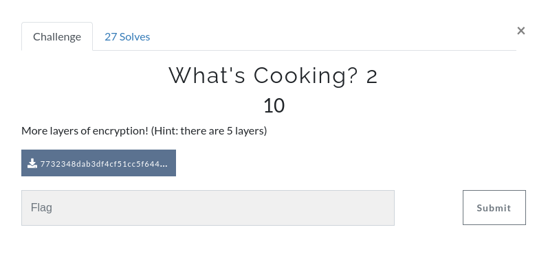
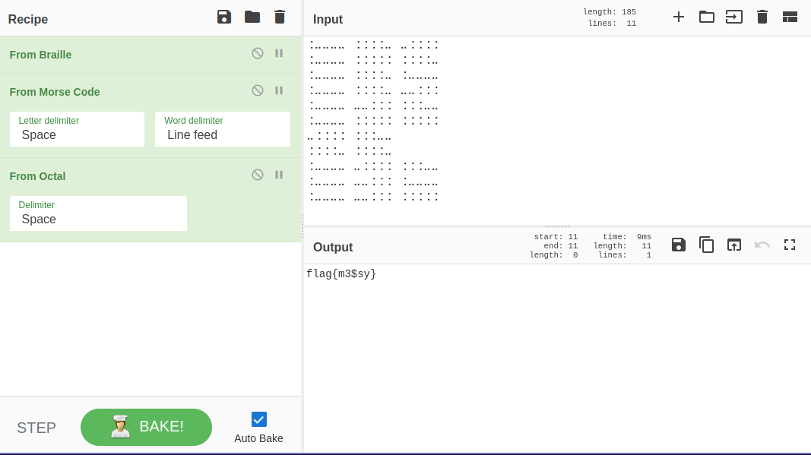

We are given this base32 text:

```base32
GRYUG3ZUOFBWWNDRINVTI4KDNM2HCQ3LGRYUGQJUOFBW6NDRINXTI4KDN42HCQ3PGRYUG2ZUOFBUCNDRINVTI4KDN42HCQ3PGRYUG3ZUOFBW6Q3VJNTXCT2LM5YE6S3HOBHUWZ3QJ5FWO4CPJNTWOT2LM5YU6S3HOFHUWZ3RJ5FWO4KPJNTXCT2LM5TU6S3HOFHUWZ3RJ5FWO4KPJNTXCT2LM5YEC4TJN5FWU2LPJNKGS32LKRUW6S2UNFXUWVDJN5EUI2LPJNVGS32LNJUW6S3KNFXUW2TJN5FVI2LPJFCGS32LNJUW6S2UNFXUWVDJN5FVI2LPJNIUWNDRINXTI4KDNM2HCQ3LGRYUG2ZUOFBWWNDRINATI4KDN42HCQ3PGRYUG3ZUOFBW6NDRINVTI4KDIE2HCQ3LGRYUG2ZUOFBW6NDRINXTI4KDN5BXKS3HOFHUWZ3QJ5FWO4CPJNTXAT2LM5YE6S3HM5HUWZ3QJ5FWO4CPJNTXCT2LM5YU6S3HOFHUWZ3HJ5FWO4KPJNTXCT2LM5YU6S3HOBHUWZ3QIFZGS32LNJUW6S2UNFXUWVDJN5FVI2LPJNKGS32JIRUW6S3KNFXUW2TJN5FWU2LPJNVGS32LNJUW6SKENFXUW2TJN5FWU2LPJNVGS32LNJUW6S3HJM2HCQ3LGRYUG3ZUOFBW6NDRINXTI4KDN42HCQ2BGRYUG3ZUOFBW6NDRINXTI4KDNM2HCQ3LIN2UWZ3RJ5FWO4KPJNTXCT2LM5YU6S3HOBHUWZ3HJ5FWO4KPJNTXCT2LM5YU6S3HOFHUWZ3QIFZGS32LNJUW6S2UNFXUWVDJN5FVI2LPJNKGS32JIRUW6S2UNFXUW2TJN5FWU2LPJNVGS32LNJUW6SKENFXUW2TJN5FWU2LPJNVGS32LKRUW6S2RJM2HCQ3PGRYUG2ZUOFBWWNDRINVTI4KDNM2HCQ2BGRYUG2ZUOFBWWNDRINXTI4KDN42HCQ3PGRYUGQJUOFBW6NDRINVTI4KDNM2HCQ3LGRYUG22DOVFWO4KPJNTXAT2LM5YE6S3HOBHUWZ3QJ5FWOZ2PJNTXAT2LM5YE6S3HOFHUWZ3RJ5FWO4KPJNTWOT2LM5YU6S3HOFHUWZ3RJ5FWO4KPJNTXCQJ5HU======
```
When we decode it we get a base64
```base64
4qCo4qCk4qCk4qCk4qCk4qCA4qCo4qCo4qCo4qCo4qCk4qCA4qCk4qCo4qCo4qCo4qCoCuKgqOKgpOKgpOKgpOKgpOKggOKgqOKgqOKgqOKgqOKgqOKggOKgqOKgqOKgqOKgqOKgpArioKjioKTioKTioKTioKTioIDioKjioKjioKjioKjioKTioIDioKjioKTioKTioKTioKQK4qCo4qCk4qCk4qCk4qCk4qCA4qCo4qCo4qCo4qCo4qCk4qCA4qCk4qCk4qCo4qCo4qCoCuKgqOKgpOKgpOKgpOKgpOKggOKgpOKgpOKgqOKgqOKgqOKggOKgqOKgqOKgqOKgpOKgpArioKjioKTioKTioKTioKTioIDioKjioKjioKjioKjioKjioIDioKjioKjioKjioKjioKgK4qCk4qCo4qCo4qCo4qCo4qCA4qCo4qCo4qCo4qCk4qCkCuKgqOKgqOKgqOKgqOKgpOKggOKgqOKgqOKgqOKgqOKgpArioKjioKTioKTioKTioKTioIDioKTioKjioKjioKjioKjioIDioKjioKjioKjioKTioKQK4qCo4qCk4qCk4qCk4qCk4qCA4qCk4qCk4qCo4qCo4qCo4qCA4qCo4qCk4qCk4qCk4qCkCuKgqOKgpOKgpOKgpOKgpOKggOKgpOKgpOKgqOKgqOKgqOKggOKgqOKgqOKgqOKgqOKgqA==
```
To decode it one command we can use:
```shell
❯ base32 -d 7732348dab3df4cf51cc5f6443aa6e38.txt | base64 -d
⠨⠤⠤⠤⠤⠀⠨⠨⠨⠨⠤⠀⠤⠨⠨⠨⠨
⠨⠤⠤⠤⠤⠀⠨⠨⠨⠨⠨⠀⠨⠨⠨⠨⠤
⠨⠤⠤⠤⠤⠀⠨⠨⠨⠨⠤⠀⠨⠤⠤⠤⠤
⠨⠤⠤⠤⠤⠀⠨⠨⠨⠨⠤⠀⠤⠤⠨⠨⠨
⠨⠤⠤⠤⠤⠀⠤⠤⠨⠨⠨⠀⠨⠨⠨⠤⠤
⠨⠤⠤⠤⠤⠀⠨⠨⠨⠨⠨⠀⠨⠨⠨⠨⠨
⠤⠨⠨⠨⠨⠀⠨⠨⠨⠤⠤
⠨⠨⠨⠨⠤⠀⠨⠨⠨⠨⠤
⠨⠤⠤⠤⠤⠀⠤⠨⠨⠨⠨⠀⠨⠨⠨⠤⠤
⠨⠤⠤⠤⠤⠀⠤⠤⠨⠨⠨⠀⠨⠤⠤⠤⠤
⠨⠤⠤⠤⠤⠀⠤⠤⠨⠨⠨⠀⠨⠨⠨⠨⠨
```
The next thing we get is braille, so i put it in cyberchef and it had another two layers which where morse and octal.




