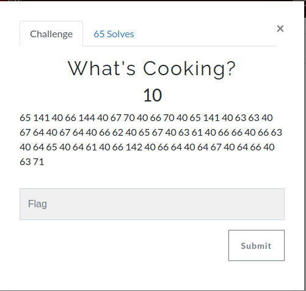
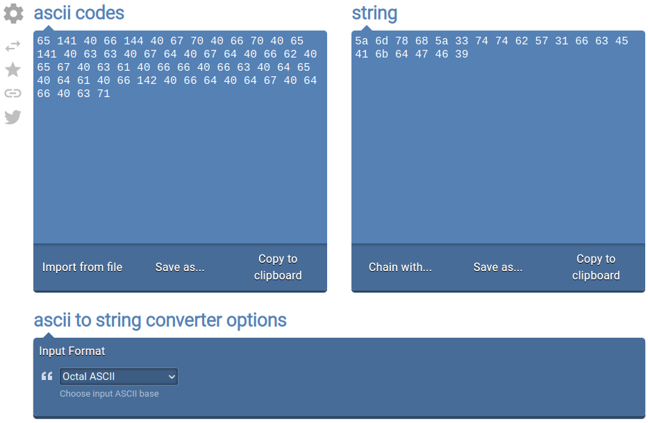
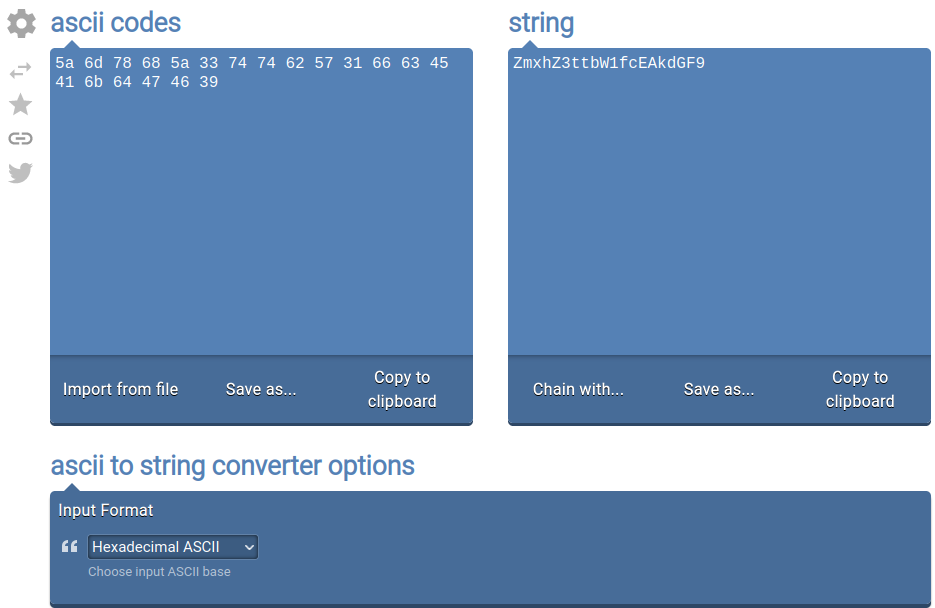

I decoded the text in this [page](https://onlinestringtools.com/convert-ascii-to-string), it was octal ascii, this gives us a hexadecimal string.



After decoding the hexadecimal we have a base64.



Decode the base64.

```shell
echo "ZmxhZ3ttbW1fcEAkdGF9" | base64 -d
flag{mmm_p@$ta}
```
