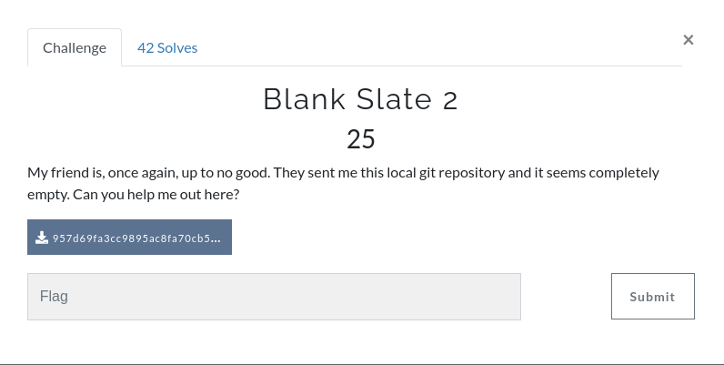

We are given a zip that contains a git repo. This git repo only has a md file

```shell
957d69fa3cc9895ac8fa70cb5e75b698 on  master
❯ cat README.md
## Welcome to my first repo!

I hope I don't accidentally put some secret information here! ;)


- Update: I did accidentally put some secret information here, but it's ok; I've taken care of it.
```

With this message we can guess that the secret info can be found in the past commits, so we check the log

```shell
957d69fa3cc9895ac8fa70cb5e75b698 on  master
❯ git log -p -2
commit c8673254c14f20cff2d166ed1e05b9ad11ab41e1 (HEAD -> master)
Author: Manav Malik <manavmalik36@gmail.com>
Date:   Thu Mar 18 22:15:20 2021 -0400

    added update to readme

diff --git a/README.md b/README.md
index d48fed1..322b544 100644
--- a/README.md
+++ b/README.md
@@ -1,3 +1,6 @@
 ## Welcome to my first repo!

 I hope I don't accidentally put some secret information here! ;)
+
+
+- Update: I did accidentally put some secret information here, but it's ok; I've taken care of it.

commit 3cbea1892950d2a2d33ef34438ab2a9284550e20
Author: Manav Malik <manavmalik36@gmail.com>
Date:   Thu Mar 18 22:14:25 2021 -0400

    removed sensitive information

diff --git a/flag b/flag
deleted file mode 100644
index f50fc31..0000000
--- a/flag
+++ /dev/null
@@ -1 +0,0 @@
-flag{w4tch_0ut_f0r_g17_h15t0ry}
```
**The flag is: flag{w4tch_0ut_f0r_g17_h15t0ry}**


