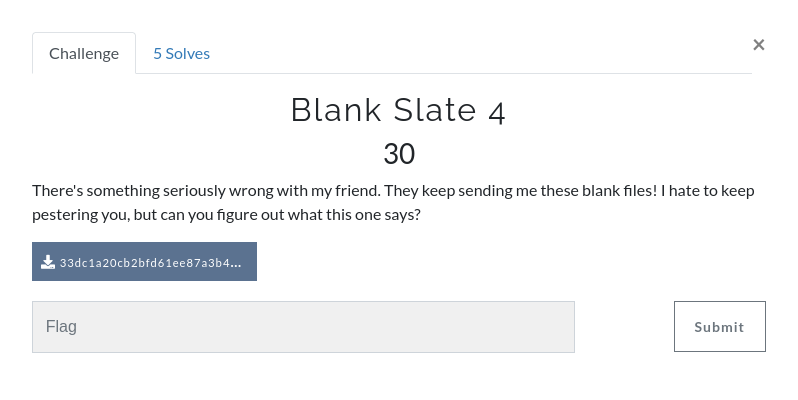
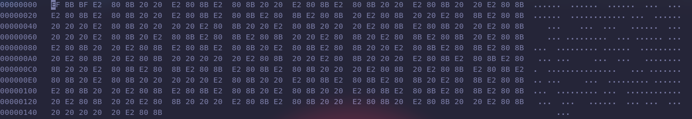

We are given a txt file that appears to be empty, one tool for empty space is stegsnow, however this won't return any output, so there must be another solution and there is, this challenge is similar to one of the picogym that i already solved thanks to this [writeup](https://github.com/Dvd848/CTFs/blob/master/2019_picoCTF/WhitePages.md)


If we inspect the file in a hexeditor we will find 3 patterns.



The first one is "EFBBBFE2808B" the second "E2808B" and the third "20", in this case we have 3 options not 2, but we can still try to convert it to binary. 

```python
f = open("33dc1a20cb2bfd61ee87a3b4126d40ca.txt", "rb") 
f = bytearray(f.read())
#print(f)
f = f.replace(b'\xef\xbb\xbf\xe2\x80\x8b',b'0')
f = f.replace(b'\xe2\x80\x8b',b'0')
f = f.replace(b'\x20', b'1')
f = f.decode("ascii")
print (f)
flag = ""
for i in range(0, len(f), 8):
    flag += chr(int(f[i:i+8],2))
print(flag)
```
**the flag is: flag{sti11_n0t_b1ank}**

