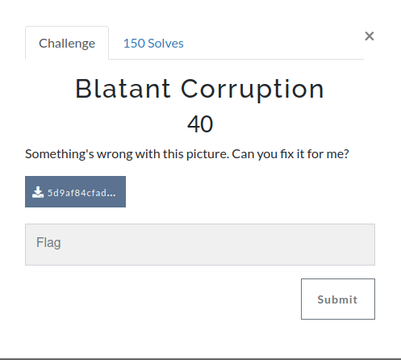
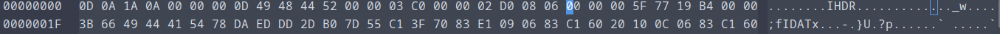
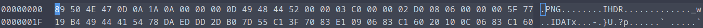
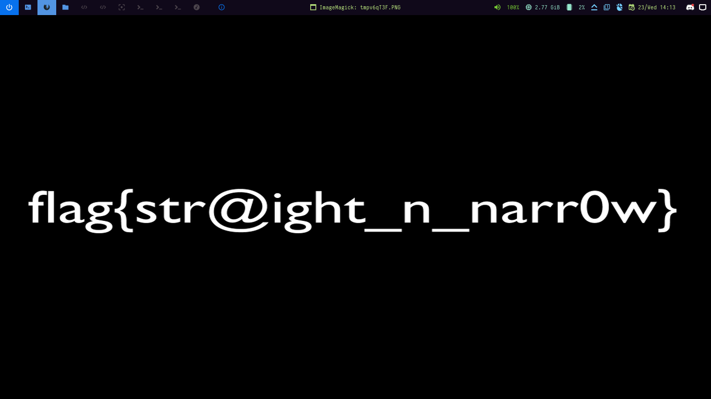

We have a corrupted image, checking the header using a hex editor reveals that we are missing the first four bytes of the png signature, but the rest of the info is there (more info on the png header [here](https://ctftime.org/writeup/31187)).



We add the missing bytes



But even with that fix the image won't open, so i used the tool [PCRT](https://github.com/sherlly/PCRT) to help me fix the image

```shell
	 ____   ____ ____ _____
	|  _ \ / ___|  _ \_   _|
	| |_) | |   | |_) || |
	|  __/| |___|  _ < | |
	|_|    \____|_| \_\|_|

	PNG Check & Repair Tool

Project address: https://github.com/sherlly/PCRT
Author: sherlly
Version: 1.1
	
[Finished] Correct PNG header
[Detected] Error IHDR CRC found! (offset: 0x1D)
chunk crc:
correct crc: 5F7719B4
[Notice] Try fixing it? (y or n) [default:y] y
[Finished] Successfully fix crc
[Finished] IHDR chunk check complete (offset: 0x8)
[Detected] Error IDAT chunk data length! (offset: 0x1D)
chunk length:5F7719B4
actual length:3B72
[Notice] Try fixing it? (y or n) [default:y] y
[Warning] Only fix because of DOS->Unix conversion
[Failed] Fixing failed, auto discard this operation...
[Detected] Error IDAT chunk data length! (offset: 0x3B9B)
chunk length:5F7719B4
actual length:3B66
[Notice] Try fixing it? (y or n) [default:y] y
[Warning] Only fix because of DOS->Unix conversion
[Failed] Fixing failed, auto discard this operation...
[Finished] IDAT chunk check complete (offset: 0x1D)
[Finished] Correct IEND chunk
[Finished] IEND chunk check complete
[Finished] PNG check complete
[Notice] Show the repaired image? (y or n) [default:n] y
```



**The flag is: flag{str@ight_n_narr0w}**
