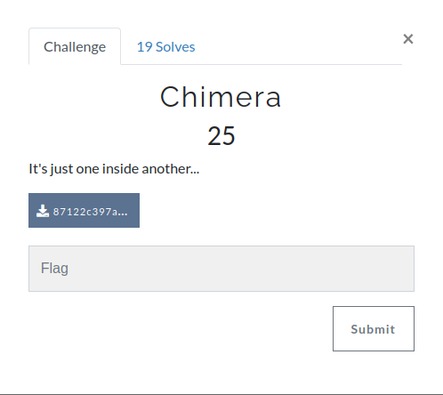
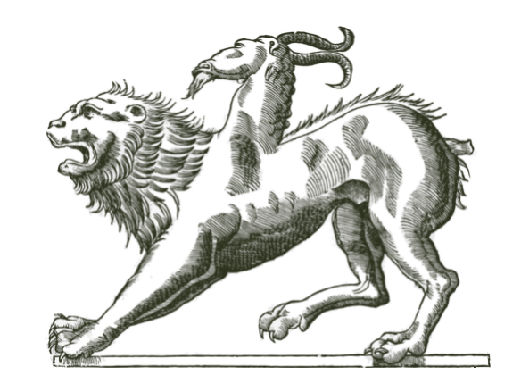
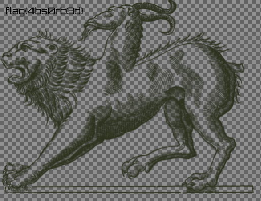

This is the image we are given



Based on the description we can assume that he image contains data inside, so i used **foremost** to extract it.

```shell
❯ foremost 87122c397ac8b10d53057a2c9ec1834e.png
Processing: 87122c397ac8b10d53057a2c9ec1834e.png
|*|

mhsctf/Forensics/Chimera
❯ ls
87122c397ac8b10d53057a2c9ec1834e.png  challenge.png  output

mhsctf/Forensics/Chimera
❯ cd output/

Forensics/Chimera/output
❯ ls
audit.txt  png

Forensics/Chimera/output
❯ cd png

Chimera/output/png
❯ ls
00000458.png

Chimera/output/png
❯ feh 00000458.png
```

This the image inside.



**The flag is: flag{4bs0rb3d}**
