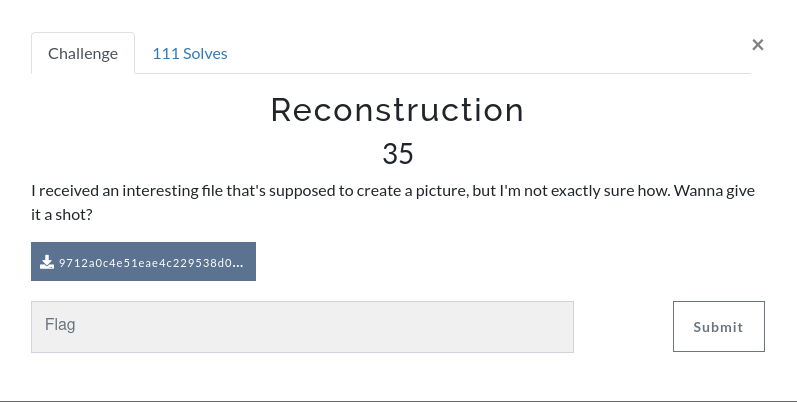
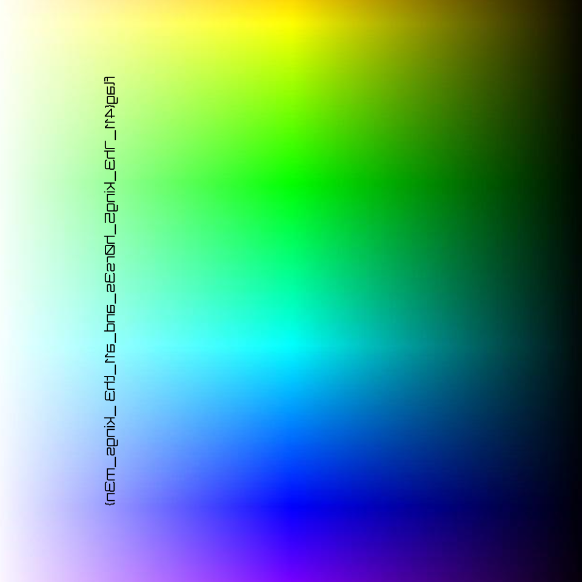
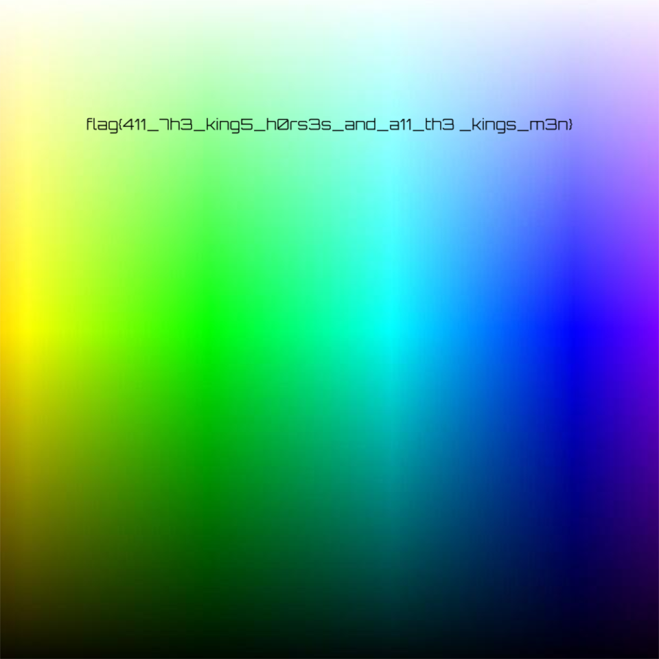

We are given a file with a bunch of numbers between 0 to 255, these are the rgb values of the image, also every 960 rgb values we have a semicolon, we can take this as a separator of rows.

We made a script to reconstruct the image based on the rgb values.

(We found out that there are 960 values in each row, so the size of the image was 960 x 960).

```python
from PIL import Image
import numpy 
import matplotlib.pyplot as plt
f = open("./9712a0c4e51eae4c229538d050ae0d38.txt", "r")
lines = f.read().strip(";")
lines = (lines.split(";"))
pixels = []
for x in lines:
    lines2 = x.strip(",").split(",") 
    pixels.append(lines2)
    
#print(len(pixels))
imagen = []
for x in pixels:
    for i in range(0,len(x),3):
        tupla = (int(x[i]),int(x[i+1]),int(x[i+2]))
        imagen.append(tupla)

im2 = Image.new(mode = 'RGB', size = (960,960))
im2.putdata(imagen)
im2.save('myimg.png')
```

This produced the following image



So we fixed it in gimp.



**The flag is: flag{411_7h3_king5_h0rs3s_and_a11_th3_kings_m3n}**
