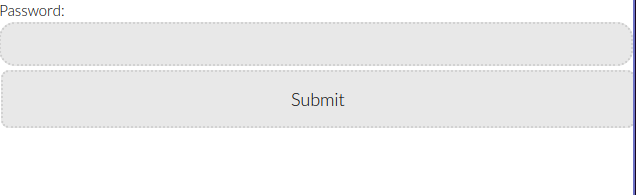
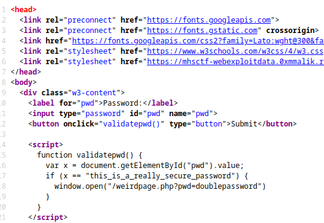
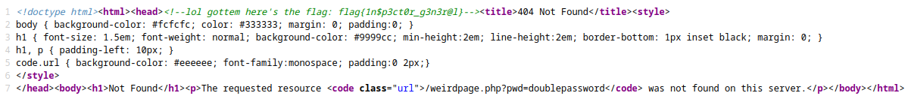

We enter to a page with just a login

If we inspect the source code we will find a function with the password

When we enter this password we are redirected to the following page

If we inspect the source code we will find the flag in a comment

**The flag is: flag{1n$p3ct0r_g3n3r@l}**
