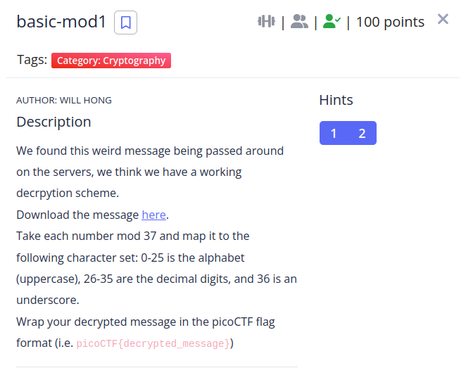

The challenge description is pretty self explanatory, here's the python script

```python
import string
alfabeto = string.ascii_lowercase
alfabeto += "0123456789_"

flag_enc = [202,137,390,235,114,369,198,110,350,396,390,383,225,258,38,291,75,324,401,142,288,397]
flag = ""
for c in flag_enc:
    pos = c % 37
    flag += alfabeto[pos]

print(flag)
```
**flag: picoCTF{r0und_n_r0und_b6b25531}**
