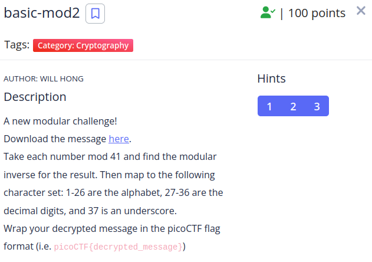

We are given the following message:
```
104 85 69 354 344 50 149 65 187 420 77 127 385 318 133 72 206 236 206 83 342 206 370
```
We apply what the description says.

```python
import string

alphabet = string.ascii_lowercase
alphabet += "0123456789_"
flag_enc = [104, 85, 69, 354, 344, 50, 149, 65, 187, 420, 77, 127, 385, 318, 133, 72, 206, 236, 206, 83, 342, 206, 370]

flag = ""
for c in flag_enc: 
    pos = pow(c, -1, 41)
    flag += alphabet[pos-1]

print(flag)
```
