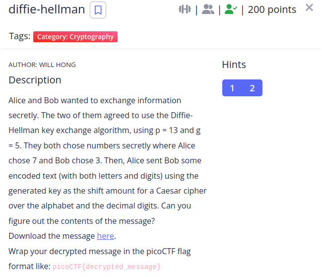

**(This challenge isn't available in picoGYM).**

### Intended Solution:

To generate the secret keys from both Alice and Bob in diffie-hellman we have to perform the following operations:
```
A = g^a mod p
B = g^b mod p
Key1 = B^a mod p
Key2 = A^b mod p
```
Having the key we use it to perform a shift in the cipher text.

I created a script to solve the challenge

```python
import string
flag_enc = "H98A9W_H6UM8W_6A_9_D6C_5ZCI9C8I_AJ8H7JJ7"
alphabet = string.ascii_uppercase + "0123456789"

p = 13
g = 5
a = 7
b = 3

def diffie_hellman_private_key(p,g,a,b):
    A = pow(g,a,p)
    B = pow(g,b,p)
    
    S1 = pow(B,a,p)
    S2 = pow(A,b,p)
    return S1, S2

def caesar_shift(shift, cipher):
    plain_text = ""
    for c in cipher:
        if c == '_' or c == ' ':
            plain_text += c
        else:
            pos = alphabet.index(c)
            pos = (pos + shift) % 36
            plain_text += alphabet[pos]
    return plain_text
    
S = diffie_hellman_private_key(p,g,a,b)
print(caesar_shift(-S[0],flag_enc))
```
```shell
❯ python solve.py
C4354R_C1PH3R_15_4_817_0U7D473D_5E3C2EE2
```
**The flag is: picoCTF{C4354R_C1PH3R_15_4_817_0U7D473D_5E3C2EE2}**

### Unintended Solution:
Since the cipher text is encoded in a caesar cipher we could just bruteforce it to get the flag, being the shift of only 5.
