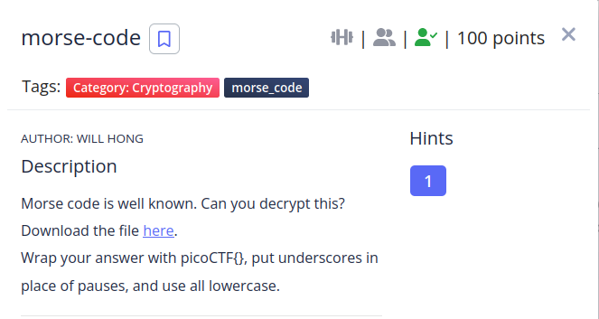

We are given a wav file that contains a morse code message, we can decipher it using this [page](https://morsecode.world/international/decoder/audio-decoder-adaptive.html).

After decoding it i transformed the result to lowercase.

**flag is: picoCTF{wh47_h47h_90d_w20u9h7}**

