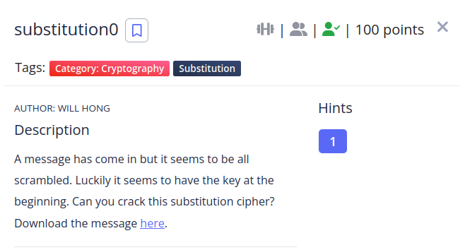

First i tried using a frecuency analysis script but i couldn't find a solution, so i used [quipqiup](https://quipqiup.com/) this gave me the flag.

**the flag is: picoCTF{5UB5717U710N_3V0LU710N_03055505}**

