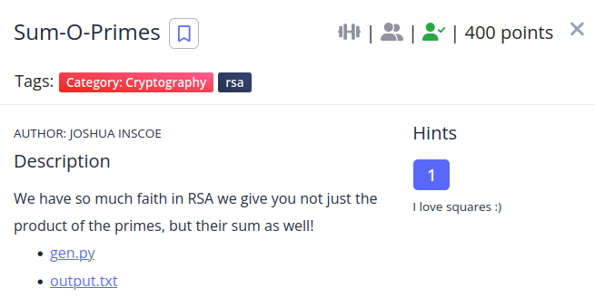

We are given two files, the generator (that's not important) and the output which contains the sum of p and q, the product of p and q and the cipher text.

```
x = 193a4f9d511dfa628e25a42de2e16123a4503c2ba1983dab3402b0f84d2b145116c3d45c4ece5c2ef62e425df830c9cf9b324edd729fdf75f8cb89cfad0d217cc83890c37e1caa39c41588deb59b0aae82291ee407dcb51c80be787ad7f61802c6811830faf12be64a8764e95471c645c5dddc686d7068126f5777c731b125198
n = 9b38de276b7e997c07bca5117230f669642491b540741badeb3cb8f096f3820149b31154bd674f3e3d7df12c96896bebfb0245d330309af05fc58d3fcfb06523c680334ef7eb9fb1bf2934ebac715b56326de577a2a45b953b6f6e22387be9fc89908a43a65a9133db084c39b18096338cd574614d4bcb5f03827a86f161370aaebdcdc1736289c4f59ab28e9eed74161c3cd9ff7de7c8c2d2845e0c9ebce843a88a3a93a7450bd4b9ab9a123569602f707489f18c3efc63f305de4d2942414c8c76d6ca18b4a8f38227c9b786857612e6fb45daee4db30a94b4cb9328e068fcabd40c0b705b944209e6c866505b1e06cb461da0858eaf7b26a043822c2a93a7
c = 93a10ce3b158c94ff48ef51204562d0ab3ce9ce73d494d059d21449e2cb1259ab7d3bd14126661d13bb4739282c2bf5995a7fa28f82f989f9f77afd28efc1a53d7729970bf7460dfb26f23286ba2e7f10917aed99fe27859c96a4e16c101d1e585f623f761dd28b1eca9be34e49ea851f5a649123283cc7d6c85c83b5a7447f1d910bbe0c5541136ce0370621d6e86e5769c160c5574d814bf2a0153de84e391cd1b538ae17c69f8c175a12bd433fd381f3e1617dfe25604e8f83e5a5fe271082e7315bbb70f992bb9a03cb1f39eac31a379620bb31a7bd22abc0f82baf7250dfdfc8f2533cf1f955e67cba94574a1dc968ba02e2fe995797815784c3d8ab74f
```

Having both the sum and the product we can find p and q using a quadratic equation.

```
n = the product of p and q.
sum = the sum of p and q.

p = x
q = y
xy = n --> 1
x+y = sum --> 2

# Clear y in 2

y = sum - x

# Substituting y in 1

x(sum-x) = n

# Multiply x

xsum - x^2 = n

# We then move all to the right

0 = x^2 - xsum + n

The two results of the equation are p and q.
```
Once i had the equation i made a python script to solve it.

```shell
from sympy import * 
import math
from Crypto.Util.number import long_to_bytes
n = "9b38de276b7e997c07bca5117230f669642491b540741badeb3cb8f096f3820149b31154bd674f3e3d7df12c96896bebfb0245d330309af05fc58d3fcfb06523c680334ef7eb9fb1bf2934ebac715b56326de577a2a45b953b6f6e22387be9fc89908a43a65a9133db084c39b18096338cd574614d4bcb5f03827a86f161370aaebdcdc1736289c4f59ab28e9eed74161c3cd9ff7de7c8c2d2845e0c9ebce843a88a3a93a7450bd4b9ab9a123569602f707489f18c3efc63f305de4d2942414c8c76d6ca18b4a8f38227c9b786857612e6fb45daee4db30a94b4cb9328e068fcabd40c0b705b944209e6c866505b1e06cb461da0858eaf7b26a043822c2a93a7"
sum = "193a4f9d511dfa628e25a42de2e16123a4503c2ba1983dab3402b0f84d2b145116c3d45c4ece5c2ef62e425df830c9cf9b324edd729fdf75f8cb89cfad0d217cc83890c37e1caa39c41588deb59b0aae82291ee407dcb51c80be787ad7f61802c6811830faf12be64a8764e95471c645c5dddc686d7068126f5777c731b125198"
ct = '93a10ce3b158c94ff48ef51204562d0ab3ce9ce73d494d059d21449e2cb1259ab7d3bd14126661d13bb4739282c2bf5995a7fa28f82f989f9f77afd28efc1a53d7729970bf7460dfb26f23286ba2e7f10917aed99fe27859c96a4e16c101d1e585f623f761dd28b1eca9be34e49ea851f5a649123283cc7d6c85c83b5a7447f1d910bbe0c5541136ce0370621d6e86e5769c160c5574d814bf2a0153de84e391cd1b538ae17c69f8c175a12bd433fd381f3e1617dfe25604e8f83e5a5fe271082e7315bbb70f992bb9a03cb1f39eac31a379620bb31a7bd22abc0f82baf7250dfdfc8f2533cf1f955e67cba94574a1dc968ba02e2fe995797815784c3d8ab74f'
sum = int(sum,16)
n = int(n, 16)
e = 65537
ct = int(ct,16)

a = 1
b = sum
c = n

x = Symbol('x')

p = (int(max(solve(a*x**2 + b*x + c, x)))) * -1
q = (int(min(solve(a*x**2 + b*x + c, x)))) * -1
#print(p)
#print(q)

m = math.lcm(p - 1, q - 1)
d = pow(e, -1, m)
pt = pow(ct, d, n)
print(long_to_bytes(pt))
```
**The flag is: picoCTF{24929c45}**
