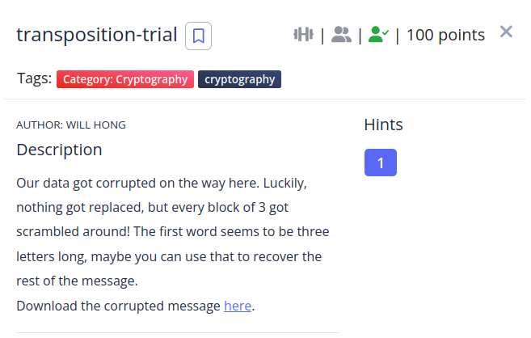

I started by analyzing the cipher text and see if it has a pattern, i found that from the start of the flag every group of three letters has the first letter in the last position, so i made a python script to fix it.

```python
flag_enc = "heTfl g as iicpCTo{7F4NRP051N5_16_35P3X51N3_V091B0AE}2"

flag = ""
for i in range(12, len(flag_enc),3):
    temp = flag_enc[i:i+3]
    flag += temp[2] + temp[0:2]

print(flag)
```
```shell
❯ python solve.py
picoCTF{7R4N5P051N6_15_3XP3N51V3_109AB02E}
```
