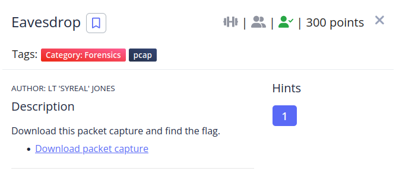
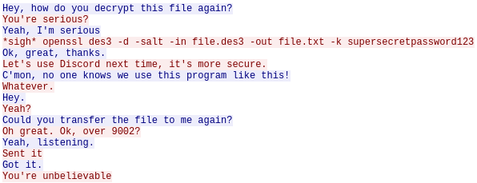
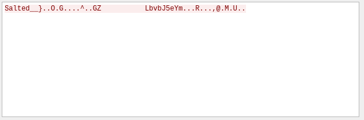

Exploring the tcp streams i found a conversation between two individuals with some interesting data.



We know the command to decrypt some file and that it's going to be sent again.

The stream 2 is what appears to be the encrypted file.


I saved it as raw because otherwise i would get a bunch of gibberish when i decrypted it.

Once saved i applied the command that was in the chat.

```shell
❯ openssl des3 -d -salt -in file.des3 -out file.txt -k supersecretpassword123
*** WARNING : deprecated key derivation used.
Using -iter or -pbkdf2 would be better.

picoCTF2022/Forensics/Eavesdrop
❯ ls
 capture.flag.pcap   file.des3   file.txt

picoCTF2022/Forensics/Eavesdrop
❯ cat file.txt
picoCTF{nc_73115_411_dd54ab67}
```

