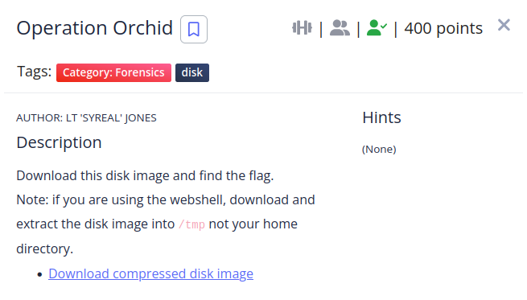

We have a .img file , the first thing i did was to mount it.


```shell
┌──(kali㉿kali)-[~]
└─$ fdisk -l disk.flag.img
Disk disk.flag.img: 400 MiB, 419430400 bytes, 819200 sectors
Units: sectors of 1 * 512 = 512 bytes
Sector size (logical/physical): 512 bytes / 512 bytes
I/O size (minimum/optimal): 512 bytes / 512 bytes
Disklabel type: dos
Disk identifier: 0xb11a86e3

Device         Boot  Start    End Sectors  Size Id Type
disk.flag.img1 *      2048 206847  204800  100M 83 Linux
disk.flag.img2      206848 411647  204800  100M 82 Linux swap / Solaris
disk.flag.img3      411648 819199  407552  199M 83 Linux
                                                                                        
┌──(kali㉿kali)-[~]
└─$ sudo mount -o loop,offset=210763776 disk.flag.img /mnt/
```
Then i entered the root folder and saw the files inside.

```shell
┌──(root㉿kali)-[/mnt/root]
└─# ls -la
total 4
drwx------  2 root root 1024 Oct  6 14:32 .
drwxr-xr-x 22 root root 1024 Oct  6 14:30 ..
-rw-------  1 root root  202 Oct  6 14:33 .ash_history
-rw-r--r--  1 root root   64 Oct  6 14:32 flag.txt.enc
```
I saw the insides of .ash_history

```shell
┌──(root㉿kali)-[/mnt/root]
└─# cat .ash_history 
touch flag.txt
nano flag.txt 
apk get nano
apk --help
apk add nano
nano flag.txt 
openssl
openssl aes256 -salt -in flag.txt -out flag.txt.enc -k unbreakablepassword1234567
shred -u flag.txt
ls -al
halt
```
As we can see the flag is encrypted using ssl, we need to decrypt it.
```shell
┌──(root㉿kali)-[/mnt/root]
└─# cat flag.txt.enc 
Salted__O金�Oez�2>@����SSgk(r�]}�}�f�z�Ȥ7� ���؎$�'%                                                                                        
┌──(root㉿kali)-[/mnt/root]
└─# openssl aes256 -d -salt -in flag.txt.enc -out flag -k unbreakablepassword1234567 
*** WARNING : deprecated key derivation used.
Using -iter or -pbkdf2 would be better.
bad decrypt
140015604639104:error:06065064:digital envelope routines:EVP_DecryptFinal_ex:bad decrypt:../crypto/evp/evp_enc.c:610:
                                                                                        
┌──(root㉿kali)-[/mnt/root]
└─# ls    
flag  flag.txt.enc
                                                                                        
┌──(root㉿kali)-[/mnt/root]
└─# cat flag        
picoCTF{h4un71ng_p457_5113beab}
```

