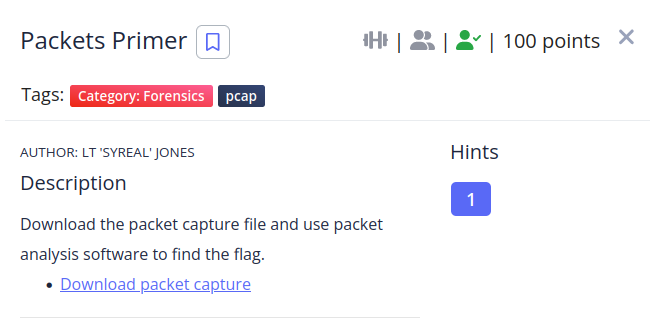
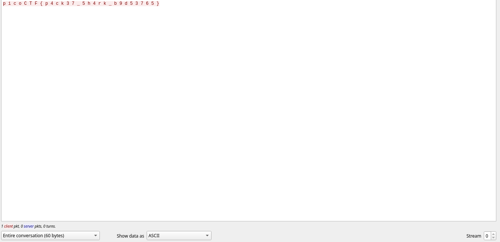

I followed the TCP stream and found the flag in the stream 0.



I removed the spaces using python
```python
❯ python
Python 3.10.2 (main, Jan 15 2022, 19:56:27) [GCC 11.1.0] on linux
Type "help", "copyright", "credits" or "license" for more information.
>>> "p i c o C T F { p 4 c k 3 7 _ 5 h 4 r k _ b 9 d 5 3 7 6 5 }".replace(" ","")
'picoCTF{p4ck37_5h4rk_b9d53765}'
```
