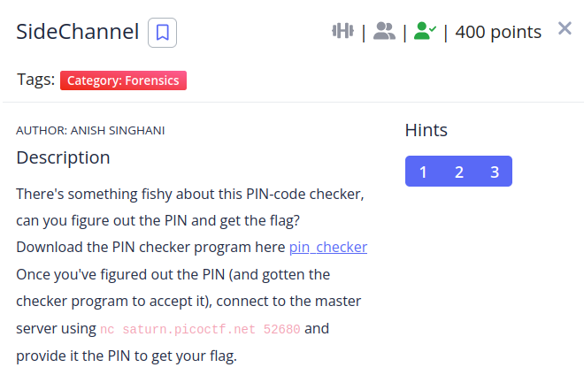

We are given a binary file that asks for the correct pin. One the hints suggests us to read about [timing attacks](https://en.wikipedia.org/wiki/Timing_attack) and i did.

What the program is doing is comparing each character of the correct pin and the user input, the moment a character is wrong the program stops, which allows this kind of attack.

```
So for example if pin = 12345678 
we can guess the right numbers by checking the time it takes 
for the program to run 
0000000 -- took 10ns the character is wrong and stopped.
1000000 -- took 100ns compared the character and its right.
1100000 -- took 100ns compared the first character but stopped at the second.
1200000 -- took 200ns compared both characters and found they are right.

The time increases for each right character.
```

I wrote a shell script to generate each number and to show the time it took to execute the program, but i  couldn't make it completely automatic so i still had to add the right number to the program. 

```shell
#!/bin/bash
for i in {0..9}
do
  pin="${i}0000000"
  echo $pin
  time ./pin_checker <<< $pin
done
```
Once the execution was finished i checked for the iteration with the highest user time value and added that number to the pin variable, after doing that 8 times i ended up with this pin **48390513**.

```shell
❯ nc saturn.picoctf.net 52680
Verifying that you are a human...
Please enter the master PIN code:
48390513
Password correct. Here's your flag:
picoCTF{t1m1ng_4tt4ck_eb4d7efb}
```

