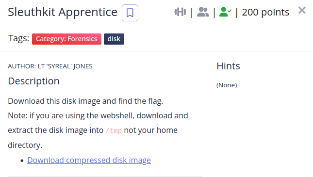

The first thing i did was trying to mount the image
```shell                                                                         
┌──(root㉿kali)-[/home/kali/Downloads]
└─# fdisk -l disk.flag.img 
Disk disk.flag.img: 300 MiB, 314572800 bytes, 614400 sectors
Units: sectors of 1 * 512 = 512 bytes
Sector size (logical/physical): 512 bytes / 512 bytes
I/O size (minimum/optimal): 512 bytes / 512 bytes
Disklabel type: dos
Disk identifier: 0x7389e82d

Device         Boot  Start    End Sectors  Size Id Type
disk.flag.img1 *      2048 206847  204800  100M 83 Linux
disk.flag.img2      206848 360447  153600   75M 82 Linux swap / Solaris
disk.flag.img3      360448 614399  253952  124M 83 Linux
                                                                           
┌──(root㉿kali)-[/home/kali/Downloads]
└─# mount -o loop,offset=184549376 disk.flag.img /mnt/
```
I mounted it at **offset=184549376** because we have a sector of 512 bytes and the part that interests us starts at 360448 (512 * 360448 = 184549376).

After analyzing most of the directories i entered the **root** directory which has a folder inside called **my_folder**,
this folder has a file called **flag.uni.txt**, printing its contents reveals the flag.

```shell
──(root㉿kali)-[/mnt]
└─# cd root
                                                                           
┌──(root㉿kali)-[/mnt/root]
└─# ls
my_folder
                                                                           
┌──(root㉿kali)-[/mnt/root]
└─# cd my_folder
                                                                           
┌──(root㉿kali)-[/mnt/root/my_folder]
└─# ls
flag.txt  flag.uni.txt
                                                                           
┌──(root㉿kali)-[/mnt/root/my_folder]
└─# cat flag.uni.txt
picoCTF{by73_5urf3r_adac6cb4}
```

