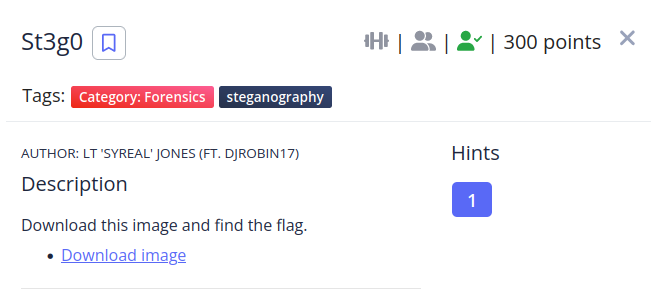

We get the following image:


Since is a png i used zsteg to inspect it and got the flag.

```shell
picoCTF2022/Forensics/st3g0 
❯ zsteg pico.flag.png
b1,rgb,lsb,xy       .. text: "picoCTF{7h3r3_15_n0_5p00n_a1062667}$t3g0"
b1,abgr,lsb,xy      .. text: "E2A5q4E%uSA"
b2,b,lsb,xy         .. text: "AAPAAQTAAA"
b2,b,msb,xy         .. text: "HWUUUUUU"
```
